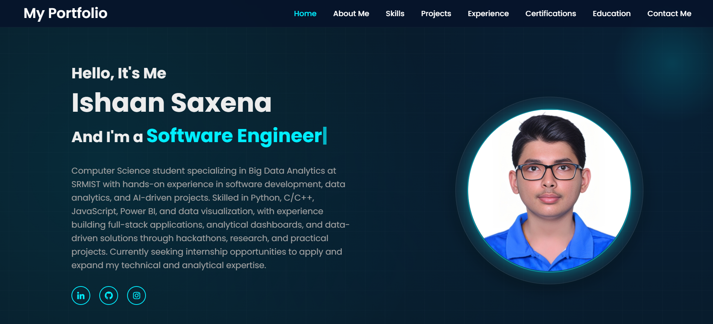
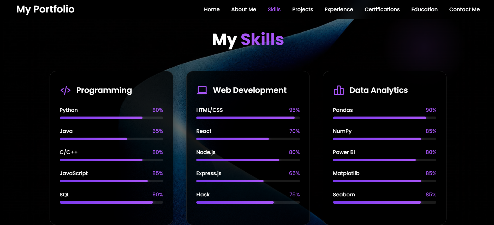
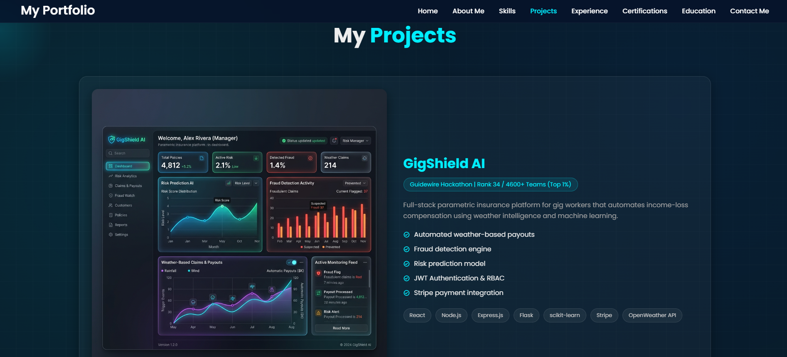

# 🚀 Ishaan Saxena — Portfolio Website

A modern, responsive personal portfolio website showcasing my projects, skills, and experience in **web development and data analytics**.

---

## 📸 Screenshots

### Homepage
 

### Skills
 

### Projects
 

---

## 🌐 Live Demo

👉 [https://ishaansaxena2005.github.io/ishaan-portfolio/](https://ishaansaxena2005.github.io/ishaan-portfolio/)

---

## ✨ Features

* 💻 Responsive and modern UI design
* 🎯 Smooth navigation with section-based layout
* ⚡ Animated typing effect using JavaScript
* 📊 Skills visualization (technical + professional skills)
* 🧠 Project showcase with live demo links
* 📱 Fully responsive across devices
* 🔗 Social media integration (LinkedIn, GitHub, Instagram)

---

## 🛠 Tech Stack

### 💻 Languages

* HTML
* CSS
* JavaScript

### 🌐 Web Development

* Responsive Design
* Flexbox & Grid
* DOM Manipulation

### 🎨 Libraries & Tools

* Boxicons
* Typed.js

---

## ⚙️ How to Run Locally

1. Clone the repository

```bash
git clone https://github.com/IshaanSaxena2005/ishaan-portfolio.git
```

2. Open the project folder

3. Run the project

```bash
index.html
```

in your browser.

---

## 🎯 Purpose of the Project

This portfolio was built to:

* Showcase my development skills
* Highlight my projects and achievements
* Create a professional online presence
* Practice frontend development and UI design

---

## 🚀 Future Improvements

* [ ] Add backend for contact form
* [ ] Add project filtering system
* [ ] Improve animations and transitions
* [ ] Optimize performance

---

## 👨‍💻 Author

**Ishaan Saxena**
B.Tech CSE (Big Data Analytics)
SRM Institute of Science and Technology

🔗 GitHub: [https://github.com/IshaanSaxena2005](https://github.com/IshaanSaxena2005)
🔗 LinkedIn: [https://www.linkedin.com/in/ishaan-saxena2005](https://www.linkedin.com/in/ishaan-saxena2005)

---

## ⚠️ Disclaimer

This is a personal portfolio website created for educational and professional purposes. No sensitive data is collected.
